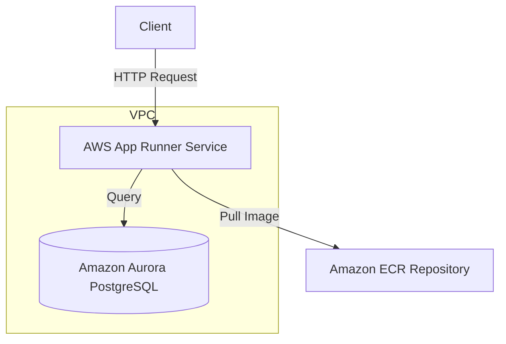

# Vitality API Architecture

> **Summary**: A concise overview of this architecture is available in the [API Architecture Summary](./api_summary.md).

## Overview

The Vitality API is deployed as an AWS App Runner service, providing a serverless, scalable solution for the application's backend. The service connects to a PostgreSQL database (Amazon Aurora) for data persistence and is integrated with the project's VPC for security and resource isolation.

## Architecture Diagram

## Components

| Component | Description | 
|-----------|-------------|
| AWS App Runner | Fully managed service for running containerized web applications and APIs |
| Amazon ECR | Container registry for storing, managing, and deploying Docker container images |
| Amazon Aurora PostgreSQL | Fully managed, PostgreSQL-compatible relational database |
| VPC | Isolated network environment for secure resource deployment |
| Security Groups | Virtual firewalls controlling inbound and outbound traffic |

## Implementation

The API service is implemented using the following technologies:

- **Backend Framework**: Bun.js - A fast JavaScript runtime and toolkit
- **Database Driver**: postgres - A PostgreSQL client for Node.js
- **Container**: Docker - For packaging the application and its dependencies
- **Infrastructure as Code**: Terraform - For provisioning and managing AWS resources

## Deployment Process

1. The application is containerized using Docker
2. The container image is pushed to Amazon ECR
3. AWS App Runner pulls the image from ECR and deploys it
4. App Runner connects to the VPC using a VPC Connector
5. The service accesses the database through a security group rule

## Security

- VPC isolation ensures that the database is not publicly accessible
- Security groups restrict traffic between the API service and the database
- Environment variables for sensitive configuration (database credentials)
- IAM roles with minimal required permissions

## Scalability

- AWS App Runner automatically scales based on traffic patterns
- The service can scale to zero when not in use, reducing costs
- Aurora PostgreSQL provides scalable database performance

## Monitoring and Logging

- AWS CloudWatch for service and application monitoring
- Application logs are streamed to CloudWatch Logs
- Health checks ensure service availability

## Next Steps

- Implement CI/CD pipeline for automated deployments
- Add custom domain and SSL/TLS certificate
- Set up monitoring and alerting
- Implement auto-scaling policies based on load patterns 