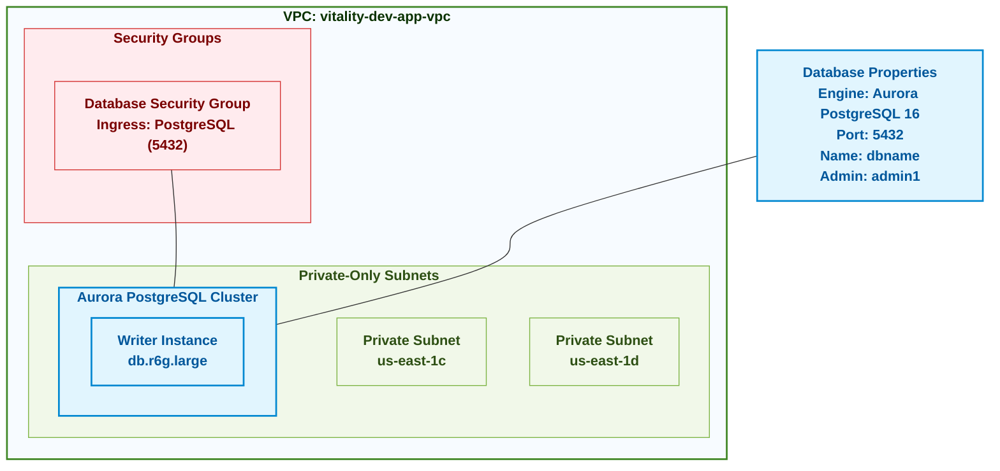

# Vitality Database Architecture

## Database Diagram



## Database Components

| Component | Description | Details |
|-----------|-------------|---------|
| Aurora PostgreSQL Cluster | Amazon Aurora PostgreSQL-compatible database | Engine: Aurora PostgreSQL 16<br>Instance Type: db.r6g.large<br>Port: 5432 |
| Writer Instance | Primary database instance that handles write operations | Instance Type: db.r6g.large<br>Count: 1 (Dev environment) |
| Private Subnets | Isolated network segments for database deployment | Located in us-east-1c, us-east-1d<br>No direct internet access |
| Security Group | Network access control for the database | Allows inbound traffic on port 5432<br>From application security group |

## Architecture Overview

The Vitality database architecture utilizes Amazon Aurora PostgreSQL, a cloud-native relational database that combines the performance and availability of high-end commercial databases with the simplicity and cost-effectiveness of open-source databases.

### Key Components

1. **Aurora PostgreSQL Cluster**: A fully managed database cluster with the following characteristics:
   - Aurora PostgreSQL 16 compatibility
   - High performance through specialized storage architecture
   - Automatic backup and recovery capabilities
   - Simplified management through AWS RDS

2. **Instance Configuration**:
   - Writer Instance: db.r6g.large (ARM-based) for optimal cost/performance ratio
   - Development environment has 1 writer instance
   - Production would scale to 1 writer and multiple reader instances

3. **Network Architecture**:
   - Deployed in private subnets for enhanced security
   - No direct internet access
   - Accessed only through application layer via security groups

4. **Security Features**:
   - Network isolation through VPC and private subnets
   - Access control via security groups
   - Authentication via username/password (would use IAM authentication in production)
   - Encryption at rest and in transit

## Implementation Details

The database infrastructure is implemented using the CloudPosse RDS Cluster Terraform module, which creates:

1. An Aurora PostgreSQL cluster with specified parameters
2. Appropriate subnet group based on provided subnets
3. Parameter groups for database configuration
4. Monitoring and logging setup

Key configuration parameters:

```hcl
module "rds_cluster_aurora_postgres" {
  engine          = "aurora-postgresql"
  cluster_family  = "aurora-postgresql16"
  cluster_size    = 1  # 1 for dev, more for production
  instance_type   = "db.r6g.large"
  db_name         = "dbname"
  db_port         = 5432
  admin_user      = "admin1"
  security_groups = [data.aws_security_group.db_sg.id]
  subnets         = local.private_only_subnet_details[*].subnet_id
}
```

## Security Considerations

1. **Network Security**:
   - Database is isolated in private subnets
   - Security groups limit access to specific ports and source IPs/security groups
   - No public endpoints exposed

2. **Access Control**:
   - Restricted admin access
   - Application uses dedicated database users (not admin)
   - Password policies and rotation (would be implemented in production)

3. **Data Protection**:
   - Encryption at rest using AWS KMS
   - Encrypted connections (SSL/TLS)
   - Automated backups for point-in-time recovery

## Performance and Scalability

The current Aurora PostgreSQL configuration provides:

1. **Performance**:
   - db.r6g.large instances offer good performance for development workloads
   - Aurora storage architecture provides faster performance than standard PostgreSQL

2. **Scalability**:
   - Vertical scaling: Can change instance types for more CPU/memory
   - Horizontal scaling: Can add read replicas for read-heavy workloads
   - Storage automatically scales up to 128 TiB

3. **High Availability**:
   - Automatic failover capability
   - Production would use multiple Availability Zones
   - Aurora's distributed storage provides 6 copies of data across 3 AZs

## Future Enhancements

1. **Production Ready Upgrades**:
   - Add read replicas for better performance and availability
   - Implement IAM authentication instead of password authentication
   - Set up automated snapshot schedules and retention policies

2. **Monitoring and Maintenance**:
   - Configure Enhanced Monitoring for detailed metrics
   - Set up Performance Insights for query analysis
   - Implement automated maintenance windows

3. **Disaster Recovery**:
   - Configure cross-region read replicas
   - Implement automated backup export to S3
   - Create database migration procedures

## References

- [CloudPosse RDS Cluster Module](https://github.com/cloudposse/terraform-aws-rds-cluster)
- [Amazon Aurora Documentation](https://docs.aws.amazon.com/AmazonRDS/latest/AuroraUserGuide/CHAP_AuroraOverview.html)
- [Aurora PostgreSQL Best Practices](https://docs.aws.amazon.com/AmazonRDS/latest/AuroraUserGuide/AuroraPostgreSQL.BestPractices.html)
- [AWS Database Security Best Practices](https://docs.aws.amazon.com/whitepapers/latest/aws-security-best-practices/securing-your-databases.html) 