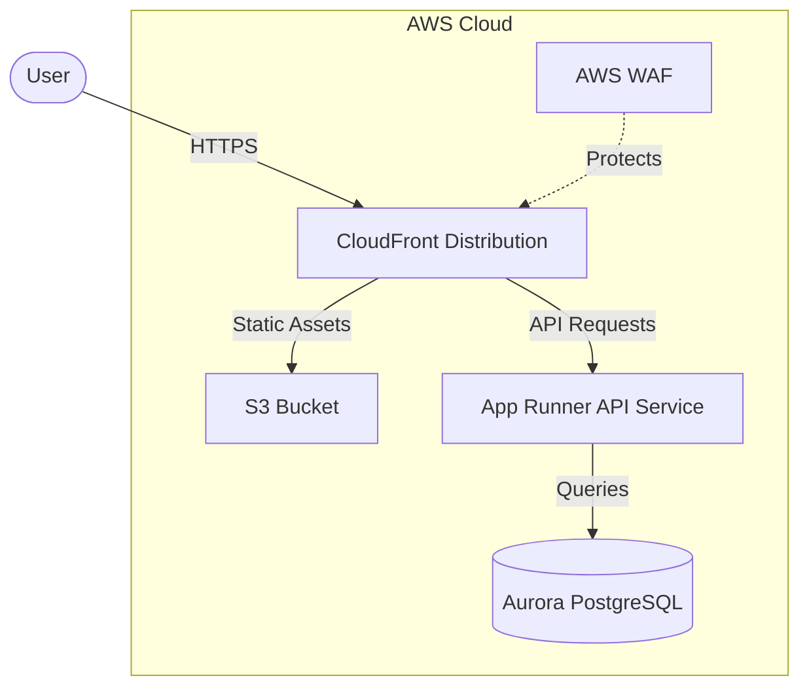

# Vitality Frontend Architecture

## Overview

The Vitality frontend is a Next.js application deployed as a static site on AWS S3, distributed through CloudFront with WAF protection. This architecture provides high availability, global distribution, and protection against common web vulnerabilities.

## Architecture Diagram

## Components

| Component | Description | Resource Type |
|-----------|-------------|---------------|
| Next.js Application | Frontend web application built with React and Next.js | Source Code |
| S3 Bucket | Storage for static HTML, CSS, JS, and media files | aws_s3_bucket |
| CloudFront Distribution | CDN for fast content delivery | aws_cloudfront_distribution |
| WAF Web ACL | Protection against common web attacks | aws_wafv2_web_acl |
| Origin Access Identity | Secure access from CloudFront to S3 | aws_cloudfront_origin_access_identity |

## Implementation Details

### Next.js Application

- Built with Next.js 15.2.3 and React 19
- Uses TypeScript for type safety
- Styled with TailwindCSS
- Static site generation for improved performance

### S3 Bucket

- Private bucket with no public access
- Versioning enabled for rollback capability
- Life cycle policies for cost optimization
- Access limited to CloudFront via Origin Access Identity

### CloudFront Distribution

- Global distribution with edge locations
- HTTPS enforced with TLS 1.2+
- Custom caching behaviors:
  - Static assets: 24-hour cache
  - API requests: No caching, proxied to App Runner
- Custom error handling for SPA routing (404→200)

### WAF Web ACL

- AWS Managed Rules:
  - Core rule set (AWSManagedRulesCommonRuleSet)
  - Known bad inputs (AWSManagedRulesKnownBadInputsRuleSet)
- Rate-based rules to prevent DDoS attacks
- IP-based access control

## Security Considerations

- All traffic encrypted with HTTPS
- No public access to S3 bucket
- WAF protection against OWASP Top 10 vulnerabilities
- Content Security Policy headers
- Regular security updates for frontend libraries

## Performance Optimizations

- Static site generation for fast initial load
- Global CDN distribution via CloudFront
- Browser caching with appropriate cache headers
- Image optimization with Next.js Image component
- CSS/JS minification and bundling

## Deployment Process

1. Next.js application built with `npm run build` and `next export`
2. Generated static files uploaded to S3
3. CloudFront cache invalidation for immediate updates
4. Infrastructure managed with Terraform

## Monitoring and Logging

- CloudFront access logs for traffic analysis
- S3 access logs for audit trail
- WAF logs for security monitoring
- CloudWatch alarms for abnormal patterns
- Error tracking with integrated monitoring tools

## Cost Optimization

- S3 lifecycle rules for older versions
- CloudFront caching to reduce origin requests
- Appropriate instance sizing for development/production

## Future Enhancements

- Custom domain with SSL certificate
- A/B testing capabilities
- Edge functions for personalization
- Enhanced caching strategies
- Automated CI/CD pipeline 