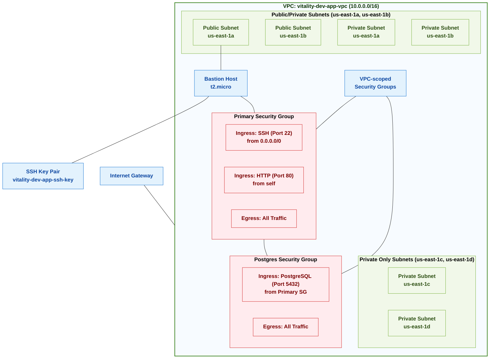

# Vitality Network Architecture

## Network Diagram

## Network Components

| Resource | Description | Details |
|----------|-------------|---------|
| VPC | Main Virtual Private Cloud | CIDR: 10.0.0.0/16 |
| Public/Private Subnets | Subnets with both public and private access | AZs: us-east-1a, us-east-1b CIDR: Subset of 10.0.0.0/16 |
| Private Only Subnets | Subnets with private access only | AZs: us-east-1c, us-east-1d CIDR: Subset of 10.0.0.0/16 |
| Primary Security Group | Main security group for standard access | Ingress: SSH (22), HTTP (80) Egress: All traffic |
| Postgres Security Group | Security group for PostgreSQL access | Ingress: PostgreSQL (5432) from Primary SG Egress: All traffic |
| Bastion Host | Jump server for secure access to private resources | Instance Type: t2.micro Location: Public Subnet |
| SSH Key Pair | Key pair for secure SSH access | Generated from local file or created by Terraform |

## Security Group Scope

Security groups in AWS are **VPC-level resources**. This means:

1. They are created and exist within the context of a specific VPC
2. They can be attached to resources within that VPC only
3. They can reference other security groups only within the same VPC
4. Rules can control traffic entering and leaving resources regardless of subnet

## Network Design Principles

1. **Segmentation**: The network is segmented into public, private, and private-only subnets for different security requirements.
2. **Secure Access**: A bastion host in the public subnet provides secure access to resources in private subnets.
3. **Least Privilege**: Security groups restrict traffic to only necessary ports and protocols.
4. **High Availability**: Resources are deployed across multiple availability zones.
5. **Future Expansion**: The design allows for future expansion of subnets and additional resources.

## Security Measures

- SSH access is restricted to the bastion host
- PostgreSQL access is limited to resources within the Primary Security Group
- All internal HTTP traffic is contained within the security group
- Private resources do not have direct internet access

## References

- [CloudPosse VPC Module](https://github.com/cloudposse/terraform-aws-vpc)
- [CloudPosse Dynamic Subnets Module](https://github.com/cloudposse/terraform-aws-dynamic-subnets)
- [CloudPosse Security Group Module](https://github.com/cloudposse/terraform-aws-security-group)
- [CloudPosse EC2 Bastion Server Module](https://github.com/cloudposse/terraform-aws-ec2-bastion-server) 