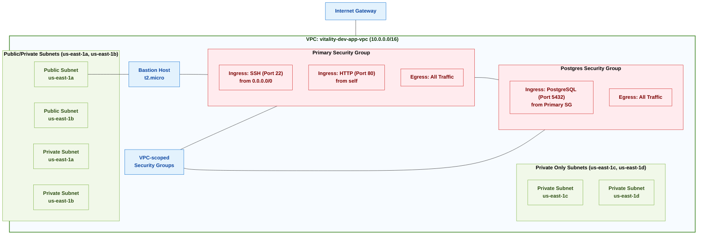

# Vitality Network Architecture

## Network Diagram

## Network Components

| Resource | Description | Details |
|----------|-------------|---------|
| VPC | Main Virtual Private Cloud | CIDR: 10.0.0.0/16 |
| Public/Private Subnets | Subnets with both public and private access | AZs: us-east-1a, us-east-1b CIDR: Subset of 10.0.0.0/16 |
| Private Only Subnets | Subnets with private access only | AZs: us-east-1c, us-east-1d CIDR: Subset of 10.0.0.0/16 |
| Primary Security Group | Main security group for standard access | Ingress: SSH (22), HTTP (80) Egress: All traffic |
| Postgres Security Group | Security group for PostgreSQL access | Ingress: PostgreSQL (5432) from Primary SG Egress: All traffic |
| Bastion Host | Jump server for secure access to private resources | Instance Type: t2.micro Location: Public Subnet |

## Security Group Scope

Security groups in AWS are **VPC-level resources**. This means:

1. They are created and exist within the context of a specific VPC
2. They can be attached to resources within that VPC only
3. They can reference other security groups only within the same VPC
4. Rules can control traffic entering and leaving resources regardless of subnet

## Network Design Principles

1. **Segmentation**: The network is segmented into public, private, and private-only subnets for different security requirements.
2. **Secure Access**: A bastion host in the public subnet provides secure access to resources in private subnets.
3. **Least Privilege**: Security groups restrict traffic to only necessary ports and protocols.
4. **High Availability**: Resources are deployed across multiple availability zones.
5. **Future Expansion**: The design allows for future expansion of subnets and additional resources.

## Security Measures

- SSH access is restricted to the bastion host
- PostgreSQL access is limited to resources within the Primary Security Group
- All internal HTTP traffic is contained within the security group
- Private resources do not have direct internet access

## Growth

The current network architecture provides a solid foundation, but as the application grows, several enhancements can be implemented:

### Scaling Address Space

1. **Additional CIDR Blocks**: The current VPC uses 10.0.0.0/16, which provides 65,536 IP addresses. As the infrastructure grows, we can:
   - Add secondary CIDR blocks to the existing VPC
   - Create specialized VPCs for distinct workloads with VPC peering
   - Implement Transit Gateway for more complex multi-VPC connectivity

2. **Subnet Expansion**: Create purpose-specific subnet tiers:
   - **Job Processing Subnets**: Isolated subnets for batch processing workloads
   - **Data Processing Subnets**: Dedicated subnets for ETL and analytics workloads
   - **Cache Tier Subnets**: Optimized for in-memory caching services like Redis/ElastiCache

### Enhanced Security

1. **Web Application Firewall (WAF)**:
   - Implement AWS WAF to protect web applications from common exploits
   - Create custom rule sets for application-specific vulnerabilities
   - Enable AWS Managed Rules for protection against OWASP Top 10 vulnerabilities

2. **Network ACLs**:
   - Add subnet-level filtering with Network ACLs as a complementary defense to security groups
   - Implement stateless filtering for specific network segments
   - Create tiered security zones with progressively stricter NACLs

3. **VPC Endpoints**:
   - Deploy interface and gateway endpoints to access AWS services without internet exposure
   - Prioritize endpoints for S3, DynamoDB, ECR, and other frequently used services
   - Configure endpoint policies to restrict access to specific resources

### Availability and Performance

1. **Multi-Region Expansion**:
   - Replicate the network architecture in additional AWS regions
   - Implement Global Accelerator for improved global routing
   - Configure Route 53 for regional failover and latency-based routing

2. **Transit Gateway Integration**:
   - Connect multiple VPCs through a centralized Transit Gateway
   - Implement routing domains for traffic segmentation
   - Enable multicast support for specialized applications

3. **Direct Connect**:
   - Establish dedicated connections to on-premises networks
   - Configure redundant connections for high availability
   - Implement BGP routing for dynamic path selection

### Operational Improvements

1. **Flow Logs and Monitoring**:
   - Enable VPC Flow Logs for comprehensive network traffic analysis
   - Integrate with CloudWatch and third-party SIEM solutions
   - Implement automated alerting for suspicious traffic patterns

2. **Network Automation**:
   - Develop CI/CD pipelines for network infrastructure changes
   - Implement automated testing for network configurations
   - Create self-service capabilities for common network operations

3. **Cost Optimization**:
   - Implement NAT Gateway sharing where appropriate
   - Use Gateway VPC Endpoints for S3 and DynamoDB to reduce NAT costs
   - Regularly review and optimize Elastic IP usage

## References

- [CloudPosse VPC Module](https://github.com/cloudposse/terraform-aws-vpc)
- [CloudPosse Dynamic Subnets Module](https://github.com/cloudposse/terraform-aws-dynamic-subnets)
- [CloudPosse Security Group Module](https://github.com/cloudposse/terraform-aws-security-group)
- [CloudPosse EC2 Bastion Server Module](https://github.com/cloudposse/terraform-aws-ec2-bastion-server) 