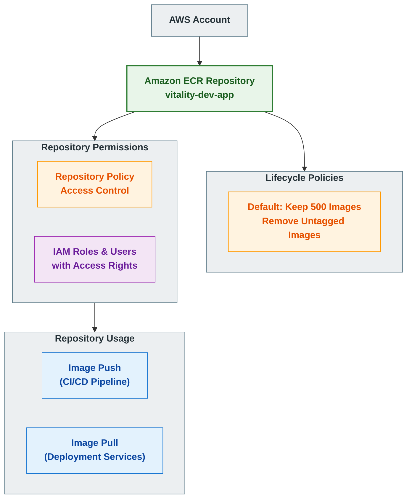

# Vitality Registry Architecture

> **Summary**: A concise overview of this architecture is available in the [Registry Architecture Summary](./registry_summary.md).

## Registry Diagram



## Registry Components

| Resource | Description | Details |
|----------|-------------|---------|
| ECR Repository | Amazon Elastic Container Registry | Name: vitality-dev-app<br>Region: us-east-1<br>Type: Private repository |
| Lifecycle Policy | Rules for image retention | Max Images: 500<br>Untagged Images: Removed after 14 days |
| Repository Policy | Access control for the repository | Controls which IAM entities can access the repository |
| IAM Roles | AWS Identity roles that can access the repository | CI/CD Roles<br>Application Deployment Roles |

## Architecture Overview

The Vitality registry architecture is built using Amazon Elastic Container Registry (ECR), a fully managed Docker container registry that makes it easy to store, manage, and deploy container images. This document outlines the design, components, and best practices implemented in our registry infrastructure.

### Key Components

1. **ECR Repository**: A private Docker container registry that stores and manages container images for the Vitality application. The repository is namespaced with project, environment, and application identifiers, following the pattern `vitality-dev-app`.

2. **Lifecycle Policies**: Automated rules that manage image retention in the repository. These policies ensure that:
   - The repository keeps no more than 500 images
   - Untagged images (often build artifacts) are automatically removed after 14 days
   - Images are retained based on tagging patterns that identify important versions

3. **Access Control**: Fine-grained permissions controlling who can push and pull images:
   - CI/CD systems have push and pull access via dedicated IAM roles
   - Application environments have pull-only access
   - All access is secured using AWS IAM and follows the principle of least privilege

## Implementation Details

The registry is implemented using CloudPosse's ECR Terraform module, which creates:

1. An ECR repository with the name constructed from the namespace, stage, and name variables
2. Default repository policies controlling access
3. Lifecycle rules for managing images over time

Example of accessing the registry:

```bash
# Login to ECR
aws ecr get-login-password --region us-east-1 | docker login --username AWS --password-stdin ${AWS_ACCOUNT_ID}.dkr.ecr.us-east-1.amazonaws.com

# Push image
docker push ${AWS_ACCOUNT_ID}.dkr.ecr.us-east-1.amazonaws.com/vitality-dev-app:latest

# Pull image
docker pull ${AWS_ACCOUNT_ID}.dkr.ecr.us-east-1.amazonaws.com/vitality-dev-app:latest
```

## Security Considerations

1. **Authentication**: All access to the ECR repository is authenticated through AWS IAM
2. **Authorization**: Permissions follow the principle of least privilege
3. **Encryption**: Images are encrypted at rest using AWS KMS
4. **Image Scanning**: Vulnerability scanning is enabled to detect security issues in container images
5. **Access Logging**: All repository actions are logged in AWS CloudTrail

## Scalability and Growth

The current registry architecture supports the immediate needs of the Vitality application, but can be expanded as follows:

1. **Multiple Repositories**: As the application grows, additional repositories can be created for:
   - Microservices components
   - Base images and shared dependencies
   - Different environments (dev, staging, production)

2. **Cross-Region Replication**: For global deployments, images can be replicated to multiple regions:
   - Improves pull performance for global deployments
   - Increases availability and disaster recovery capabilities
   - Reduces cross-region data transfer costs

3. **Enhanced Policies**:
   - More sophisticated lifecycle policies based on image age, usage patterns, and semantic versioning
   - Advanced repository policies integrating with AWS Organizations for enterprise-scale access control

## References

- [CloudPosse ECR Module](https://github.com/cloudposse/terraform-aws-ecr)
- [AWS ECR Documentation](https://docs.aws.amazon.com/ecr/)
- [ECR Lifecycle Policies](https://docs.aws.amazon.com/AmazonECR/latest/userguide/lifecycle_policy.html)
- [ECR Security Best Practices](https://docs.aws.amazon.com/AmazonECR/latest/userguide/security-best-practices.html) 